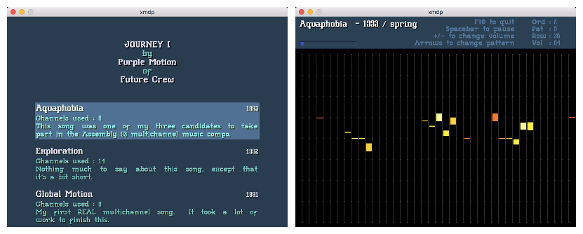

An MDP clone using libxmp
=========================

Some of us have old projects which we dust off every few years to see
if they still compile. Sometimes we fix something or add a feature or two
just for fun. For 19 years, this one was lying around incomplete, and now
I finally decided to finish it.

| 

| 

This is a clone of the Future Crew MusicDiskPlayer released in 1993 with
Journey 1/2 and Chaotic Mind. The player interface clone was written in 1997
and revised in 2005 and 2013, and in early 2016 the MDI parser and menu were
finally added. As you can expect from very old code written mostly as a proof
of concept, it's not pretty. I can live with that.

To build xmdp you need SDL 2 and libxmp 4. It was tested on Linux and
Mac OS X. After building, run the xmdp binary from the directory where
your .mdi file and modules are. Everything should work like MDP. If not,
send me an email and I'll try to fix it.

Have fun.

| Claudio Matsuoka
| Wed Feb 24 13:11:45 BRT 2016
